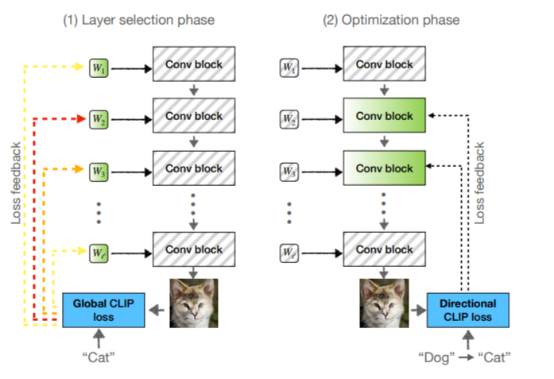
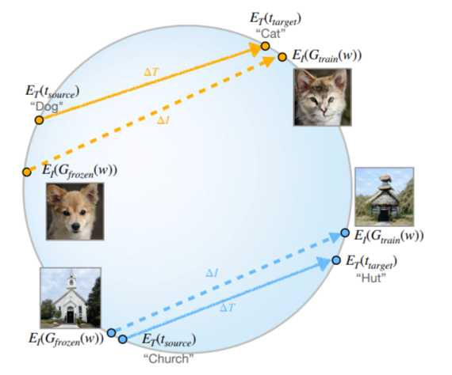
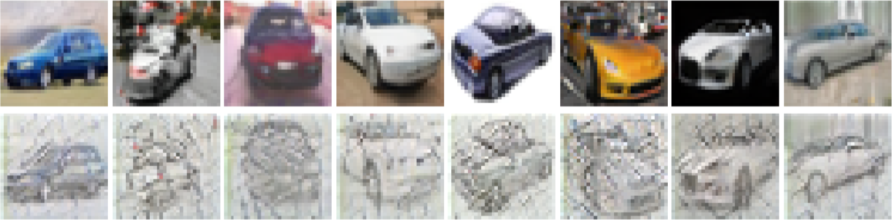
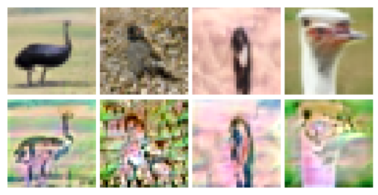

## Задача и цель 
Данный проект заключается в том, чтобы использовав только текстовый запрос, сгенерировать картинку в нужном домене. Для этого берем предобученный StyleGAN-2, который умеет генерировать лица и объекты. Для решения этой задачи мы хотим использовать CLIP модель, чтобы "направлять" нашу генерацию в нужный домен.
## Inference and Generate
Все результаты генерации картинок в нужном домене можно увидеть при последовательном запуске ячеек:
Inference: 
Код обучения: 

## Directional CLIP loss
Global loss вычисляется как косинусное сходство между ClIP вектором изображениения и CLIP вектором текстового запроса. Минусы этого метода в том, что нет разнообразия генерации новых картинкок и изменения картинки в том виде, в котором пользователь не хотел видеть. Поэтому используем следующую функцию потерь.

В данном проекте для того, чтобы правильно обучить модель исходя из задачи, необходимо выбрать нужную функцию потерь. Для этого можно взять два генератора одинаковых, один из которых будет заморожен, а другой будет обучаться. Отправив в CLIP - пространство картинку image, текстовый и желаемый запрос text (например "dog" и "cat") можно посмотреть напралвение изменения вектора text, и обучить генератор так, чтобы направление вектора image как можно более было сонаправленее с вектором text. И итоговая формулаа Directional CLIP loss вычисляется как 1 -(косинусное сходство между измененям векторов text и image).

## Исследование основных блоков для заморозки
В ходе работы необходимо было выяснить, какие блоки оказывают наиболее положительное влияние в соответствии с целевым текстовым запросом, а какие наоборот или почти не влияют. Использовался датасет CIFAR-10 (https://www.cs.toronto.edu/~kriz/cifar.html) который состоит из 10 классов и изображений 32x32.

При адаптации генератора StyleGAN2 под новые стили (аниме, скетч) на датасете CIFAR-10 оказалось, что результат сильно зависит от того, какие именно части нейросети мы обучаем.
Первые два блока отвечают за «что это за объект» (птица, кошка, машина), а последние два — за «как он выглядит».
Когда мы пытались обучать первые блоки, модель путалась и начинала генерировать неузнаваемые объекты — птицы превращались в однотонный цвет и был коллапс. А когда обучали все блоки сразу, изображения покрывались артефактами и цветовым шумом.
Лучший результат дало обучение только последних двух блоков. В этом случае модель сохраняла узнаваемость объектов (птицы оставались птицами), но при этом успешно меняла их внешний вид: добавляла яркие цвета, упрощала текстуру перьев, делала контуры чётче — то есть превращала реалистичные изображения в аниме-стиль или скетч-стиль.
Таким образом, для стилизации достаточно обучать только последние два блока генератора. Это быстро, стабильно и не ломает исходную структуру изображений — объект остается объектом, при этом виден тот стиль, который под соответующий текстовый запрос задавалася.
## Результаты 
Некоторые результаты  можно посмотреть в image.

.png)

Переобучение - большой learning-rate.

Неудачно подобранный learning-rate и ранние блоки.

## Итоги
В рамках проекта удалось успешно обучить модель генерировать изображения в целевом домене по текстовому запросу. Однако одним из потенциальных улучшений могло бы стать использование датасета FFHQ, содержащего изображения высокого разрешения (1024×1024). Это позволило бы увеличить количество блоков в архитектуре модели и детальнее проанализировать, какие из них оказывают наибольшее влияние на качество генерации. К сожалению, ограничения по видеопамяти не позволили провести полноценное обучение на таком масштабе данных. Вместо этого использовался датасет CIFAR-10 с низким разрешением (32×32), на котором модель всё же научилась генерировать изображения в заданном стиле — например, в аниме или скетч-манере. Тем не менее, добиться по-настоящему реалистичных результатов при таком разрешении не удалось.
## Cтатьи, на которые опирался
StyleGAN-NADA: CLIP-Guided Domain Adaptation of Image Generators---
StyleCLIP: Text-Driven Manipulation of StyleGAN Imagery --- 
